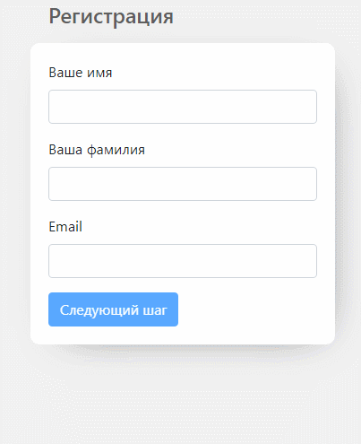

# Пошаговая форма регистрации на Vue
Регистрация пользователя на сайте по шагам

**Технологии:** [Bootstrap 4](https://getbootstrap.com) | [Vuelidate](https://vuelidate.js.org/#getting-started)



## Установка проекта
```
npm install
```

### Запуск проекта в режиме разработки
```
npm run serve
```

### Компилирует и минимизирует для продакшина
```
npm run build
```

### Запуск ESLint
```
npm run lint
```

### Customize configuration
See [Configuration Reference](https://cli.vuejs.org/config/).
